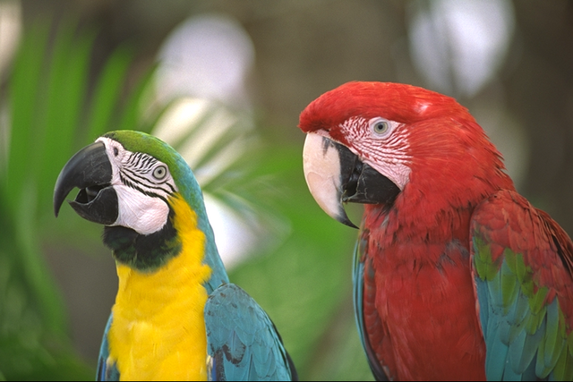
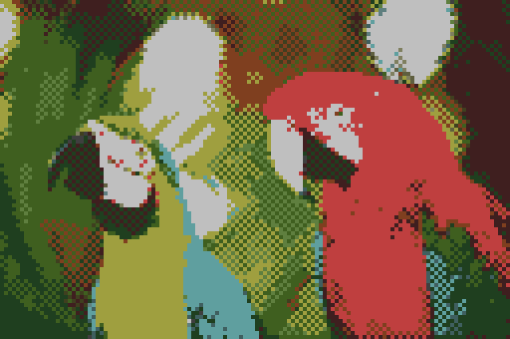
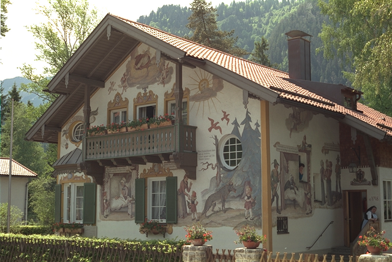
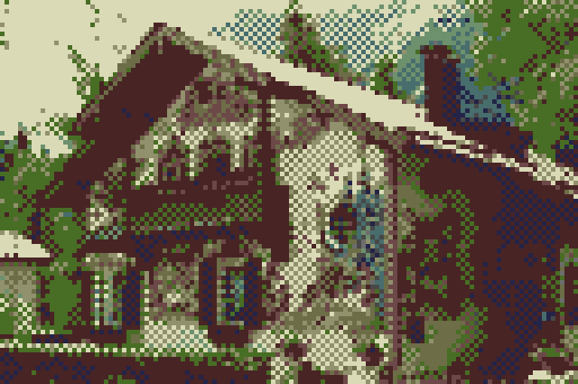

# Pixelizer - 動画や画像をピクセルアートに変換
入力された画像または動画の解像度を下げ、減色処理やディザリング（チェッカーボード柄の疑似階調表現）を施すことで、レトロゲーム風のピクセルアート、いわゆるドット絵に変換する。

## 変換例

参考データセット: https://github.com/MohamedBakrAli/Kodak-Lossless-True-Color-Image-Suite

| 変換前 | 変換後 |
| :---: | :---: |
| kodim 23 (Input) | kodim 23 (Output) |
|  |  |
| kodim 24 (Input) | kodim 24 (Output) |
|  |  |

## 主な機能

* ピクセル化（モザイク処理）
	* 指定したピクセルサイズに画像を縮小・再拡大し、ドット絵の質感を再現する。
* 中央値分割法（Median Cut）による減色
	* 画像内でよく使われている色を自動で抽出する。
* トーンカラー制約
	* 抽出した色をさらに特定の階調（トーン）に割り当て、レトロな発色を再現する。
* ディザリング
	* 2色のドットを交互に配置（ディザリング）することで、少ない色数で滑らかなグラデーションを表現する。
* コントラスト・彩度強調
	* ドット絵として見栄えが良くなるよう、自動で画像のエッジや色彩を強調する。

## 必須環境
* Python 3.x
* Pillow (PIL): 画像処理用
* OpenCV (opencv-python): 動画のフレーム抽出用

### インストール方法
```bash
pip install -r requirements.txt
```

### 実行方法
```bash
python main.py <入力ファイルパス> <出力ファイルパス> [オプション]
```

### 実行例
```bash
python main.py input.png output.png
```

```bash
python main.py input.mp4 output.gif
```

### コマンドラインオプション

| オプション | 型 | デフォルト値 | 説明 |
| --- | --- | --- | --- |
| --fps | int | 4 | 動画を出力する場合の1秒あたりのフレーム数。 |
| --pixel-size | int | 5 | ドット（ピクセル）の大きさ。値を大きくするほど、より粗いドット絵になる。 |
| --color-number | int | 16 | メディアンカットで抽出するベースの色数。 |
| --tone-number | int | 8 | 各RGBチャンネルの階調数（N の場合、N ^ 3 色のパレットから色が選択される）。 |
| --max-side | int | 640 | 入力画像の長辺の最大ピクセル数。処理の最初にこのサイズへ自動で正規化される。|